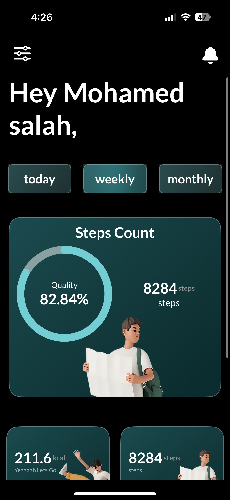
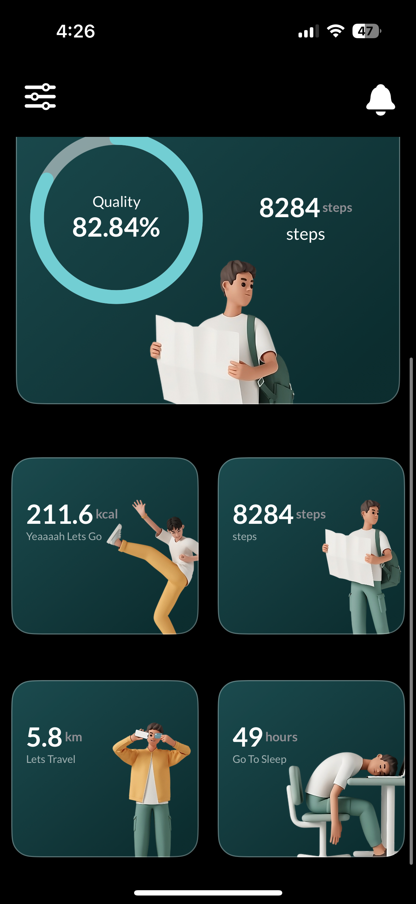
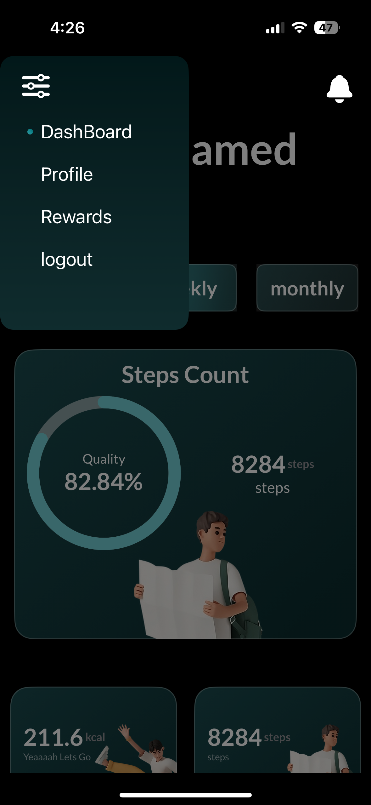
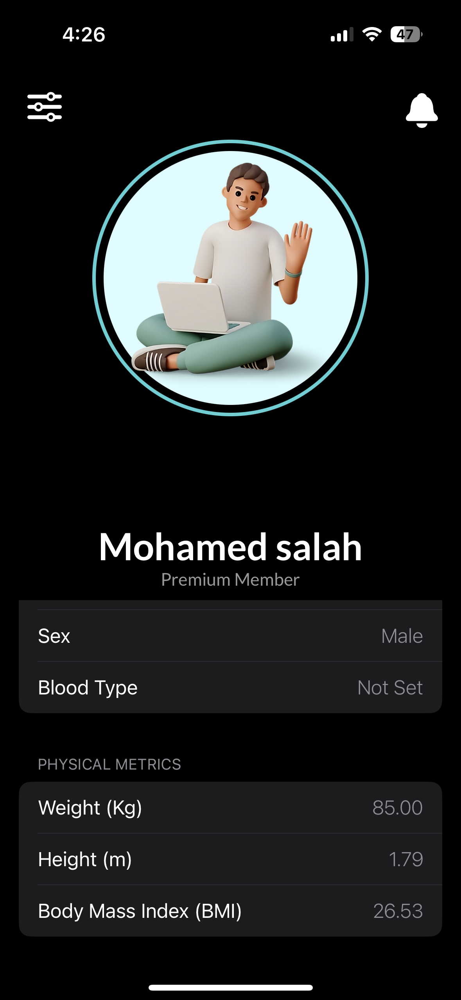
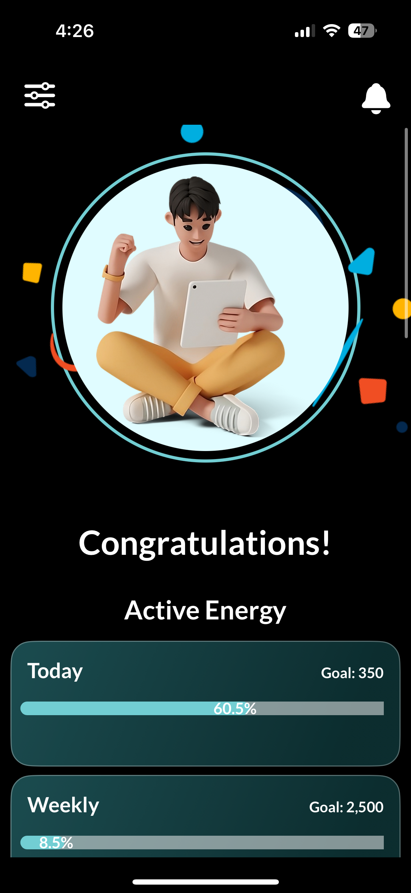
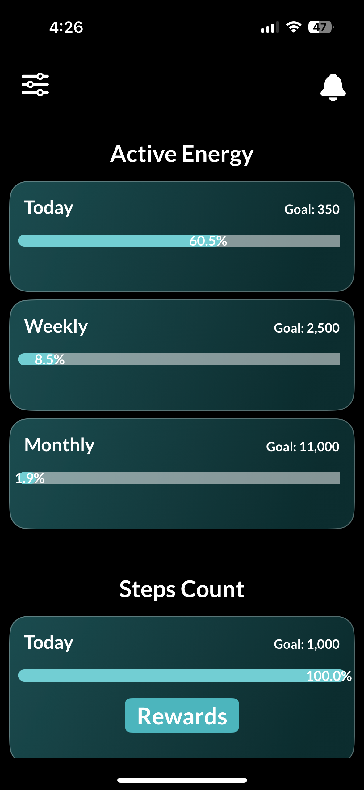

# Heal

# SwiftUI HealthKit App

## Description
This SwiftUI app is designed to demonstrate the use of SwiftUI and HealthKit. It allows users to sign in and grant HealthKit permissions, track daily, weekly, and monthly health goals, and view their health data, including height, weight, and BMI. The app also features various animations to enhance the user experience.

## Table of Contents

- [Features](#features)
- [Screenshots](#screenshots)
- [Prerequisites](#prerequisites)
- [Installation](#installation)
- [Usage](#usage)
- [Technologies Used](#technologies-used)
- [Contributing](#contributing)
- [License](#license)

## Features

- **Health Data Integration:** Your app integrates with Apple HealthKit to access user health data, including height, weight, and BMI.

- **User Profile:** It allows users to sign in and view their health data and goals on a daily, weekly, and monthly basis.

- **Animations:** Your app showcases the power of SwiftUI with various animations and transitions, making the user experience engaging and visually appealing.

- **Modern Concurrency:** The app demonstrates the use of modern concurrency features in Swift for efficient and responsive data handling.

## Screenshots

<div style="display: flex;">



</div>
<div style="display: flex;">



</div>

## Prerequisites

Before you begin, ensure you have met the following requirements:

- [Xcode](https://developer.apple.com/xcode/) installed on your development machine.
- An Apple Developer account for HealthKit integration.

## Installation

1. Clone the repository:

   ```bash
   git clone https://github.com/your-username/your-app.git
2. Open the project in Xcode.

3. Set up your Apple Developer account and configure the HealthKit permissions.

4. Build and run the app on a simulator or a physical device.

## Usage

1. **Sign In:** Open the app and sign in with your Apple ID.

2. **HealthKit Permissions:** Grant the necessary HealthKit permissions to allow the app access to your health data.

3. **Explore Health Data:** Once granted access, you can explore your health data, including details like height, weight, and BMI.

4. **Set Goals:** View your daily, weekly, and monthly health goals, and track your progress.

5. **Enjoy Animations:** Experience the engaging user interface with various SwiftUI animations and transitions.

Feel free to use the app to monitor your health and wellness while enjoying the visually appealing animations and user-friendly design.


## Technologies Used

This app leverages the following technologies and frameworks:

- **SwiftUI:** The primary framework used for building the user interface, creating animations, and providing a seamless user experience.

- **HealthKit:** Integration with Apple's HealthKit framework to access and manage user health data, such as height, weight, and BMI.

- **Modern Concurrency:** Utilizes modern concurrency features in Swift to efficiently handle data and provide a responsive user experience.

These technologies have been instrumental in creating a feature-rich and user-friendly app that seamlessly integrates with HealthKit for health data management and provides a visually engaging experience through SwiftUI animations and transitions.


## Contributing

Contributions to this project are welcome and greatly appreciated. If you'd like to contribute, please follow these steps:

1. Fork the project on GitHub.
2. Create a new branch with a descriptive name for your feature or bug fix.
3. Make your changes and ensure they are well-documented.
4. Test your changes thoroughly to make sure they work as expected.
5. Commit your changes with clear and concise commit messages.
6. Push your changes to your fork.
7. Create a new pull request to the original repository, explaining your changes and why they should be merged.

Your contributions can help improve and enhance this app, making it more valuable to its users.

Thank you for contributing!

## License

This project is licensed under the MIT License. See the [LICENSE](LICENSE) file for more details.

The MIT License is an open-source license that permits you to use, modify, and distribute this software freely, as long as you include the original copyright notice and disclaimers.

Please review the [LICENSE](LICENSE) file for the full text of the MIT License that applies to this project.

